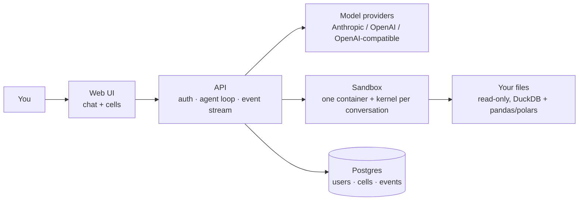

# not-a-notebook

An AI data analyst that shows its work. Drop in a messy file, ask in plain language, and every answer comes back as cells: code you can read, edit and re-run, with charts you can actually interact with.

Chat on the surface, a real notebook underneath. It works with whatever model you point it at, whether that's a frontier API, a small open model, or something running locally on your own GPU.

> **Status: early design.** Nothing to run yet. This README describes what is being built and why. Follow along, open an issue, or help shape the v0.

---

## Why this exists

Hosted AI data analysts are genuinely impressive. Upload a spreadsheet, ask a question, and you get a cleaned dataset, a chart and a careful answer.

They are built for people who don't write code, and you can see it in three places:

- **The code disappears.** It streams while the model works and then collapses. You can't reopen it, edit it or re-run it, so you can't check how a number was produced.
- **Charts are pictures.** You get static images to download, not objects you can change.
- **Nothing is reproducible.** You can export the cleaned CSV and the PNGs, but not the analysis itself.

And they all run in someone else's cloud, on someone else's model.

not-a-notebook offers the same experience to people who do write code: data engineers, analysts and developers who want to ask in plain language and still control what actually ran.

## Two ways to use it

| | |
| --- | --- |
| **Run it yourself** | Clone the repository and run `docker compose up`. The files, the database and the code execution all stay on your machine. Point it at a local model and nothing leaves at all. |
| **Use the hosted version** | The same code, run for you. It's for people who want the product without operating a server. |

Both are the same artefact. The hosted version runs the same compose file you would, so the self-host path is never a second-class citizen.

## What it does

### Every answer is cells

A cell is not a log line that scrolls past. It is a persistent object: it stays in the conversation, and you can edit and re-run it. The agent's cells and your cells are the same thing. If you edit one the agent wrote, the agent sees your version on its next turn.

Re-running a cell in the middle marks the cells below it as **stale**. **Run all** restarts the kernel and runs everything in order, and that is the button that proves an analysis is reproducible.

Exporting to `.ipynb` is a straight conversion, because the conversation already *is* a sequence of cells. The exported notebook runs anywhere, without the chat and without edits.

### The model sees a profile, not your data

On upload, before any question is asked, the file is profiled inside the sandbox. The model gets the schema, types, samples and a report of what a careful analyst would catch:

- subtotal and grand-total rows mixed in with records
- headers that aren't on the first row, and a relevant sheet that isn't the first
- exact duplicates
- mixed number formats (`1234.56`, `1.234,56`, `R$ 1.234,56`) and date formats
- inconsistent category labels (`SE`, `sudeste`, `Sudeste `)
- columns that contradict each other (revenue ≠ quantity × price)
- outliers that dominate totals
- missing values

Suspicious values are reported and shown both ways. They are never silently "fixed".

### It asks before guessing

If you ask "which region sold the most this year?" about a file that ends last year, you get a question back instead of a silent assumption.

### Any model, really

"Bring your own model" usually means "any model that does tool calling well". Small and local models often don't, but they write a fenced block of Python just fine. So the harness speaks two dialects:

| | |
| --- | --- |
| **tools** | native tool calling, for models that are good at it |
| **text** | the model writes a code block and the harness runs it |

On top of that there are three adapters: **Anthropic**, the **OpenAI Responses API**, and anything **OpenAI-compatible**. The last one covers Ollama, vLLM, LM Studio, OpenRouter, DeepSeek, Qwen and most other providers. A local Ollama is just an entry with a URL and no key.

You add keys in the UI. Keys in `.env` show up on the same screen, masked and marked as coming from the environment, and are available to everyone on the instance.

## What running code means

The model writes code, and the code runs. Taking that seriously is most of the design.

Each conversation gets its own container with a persistent Jupyter kernel. Every package is baked into the image ahead of time, because the container **has no internet**. It can reach the API that drives it and nothing else, so `pip install` fails, and so does an attempt to send your data somewhere. Your files are mounted read-only. CPU, memory and time are capped.

| | |
| --- | --- |
| **Protects against** | generated code reaching the network, touching other conversations' files, or eating the machine |
| **Does not protect against** | a container escape on plain Docker. The hosted version runs the sandbox under gVisor for exactly that reason, and so can you. |

Idle kernels are stopped to free memory. When you come back, the kernel is empty, a banner says so, and **Run all** brings the state back. The agent is told too, so it reloads the data instead of reaching for a variable that no longer exists.

### Keys and credentials

Provider keys are encrypted with **AES-256-GCM** before they reach the database. The encryption key comes from an environment variable and is never written to the database. A stored key is only ever shown back masked.

**A credential never enters the sandbox.** The kernel receives data, never a key.

**Losing `SECRETS_KEY` means losing every stored provider key.** Back it up separately from the database.

## How it works



- **Web UI.** The conversation on one side and the cells on the other: code, output, tables and interactive Plotly charts, streamed live.
- **API.** The agent loop is small and explicit. It has one real tool, `run_python`, plus asking you a question and giving the final answer.
- **Event stream.** Typed events over SSE (`code.proposed`, `exec.error`, `attempt.started`, …), each one stored with a sequence number. A dropped tab reconnects and replays what it missed. A retry shows up as a retry, not as a traceback followed by more text.
- **Sandbox.** A Jupyter kernel in a container with no network. DuckDB, pandas, polars and pyarrow are all in the image.
- **Postgres.** Accounts, conversations, cells, outputs and every event of every run.

### Signing in

Sign in with an email and password, or with Google or GitHub. The OAuth buttons appear only when their credentials are configured, so a self-hoster never has to register an OAuth app. On your own instance, the first account is yours, and `REGISTRATION_OPEN=false` closes the door behind it.

---

# Running it (planned)

Everything runs in Docker, so **Docker with Compose** is all it needs.

```bash
git clone https://github.com/not-a-corp/not-a-notebook.git
cd not-a-notebook
cp .env.example .env    # POSTGRES_PASSWORD, JWT_SECRET and SECRETS_KEY, nothing else required
docker compose up
```

Then open `http://localhost:3000`, create your account, add a model and drop in a file.

---

## v0 scope

- [ ] Accounts: email and password, plus Google and GitHub when configured
- [ ] Upload CSV, Excel and Parquet, with a profile on arrival
- [ ] Chat with the agent, on any of the three adapters, in either dialect
- [ ] Code and output cells, streamed live, editable and re-runnable
- [ ] Interactive charts (Plotly)
- [ ] Export to `.ipynb` and `.py`
- [ ] `docker compose up` working from a clean machine

## How we'll measure it

- From `docker compose up` to the first chart in **under 5 minutes**.
- A notebook exported from any conversation runs elsewhere without edits.
- A published score on **DABstep**, the public benchmark for data analysis agents.
- A compatibility table, by model and dialect, against real dirty files with human-checked answers. Each answer is counted as right, wrong-and-warned, or **wrong-and-silent**. The last one is what matters.

Built with FastAPI · PostgreSQL 18 · psycopg 3 with raw SQL · Alembic · Jupyter · DuckDB · React · TypeScript · Tailwind · Docker.

---

## What this project does not do

| | Comes in when |
| --- | --- |
| Database connectors (Postgres, MySQL, warehouses) | v1. The API runs the query, and the sandbox only receives the result. |
| SQL cells | connectors arrive. Until then `duckdb.sql(...)` works inside Python. |
| Promote to pipeline (a parameterized script or dbt model) | an analysis needs to run without the chat |
| Teams and shared workspaces | there is a team to share with |
| Reactive cells | stale marks stop being enough |
| Real-time collaboration | two people want the same notebook at once |

## Contributing

The project is at the design stage. Right now the most useful contributions are ideas, use cases, and messy real-world datasets (anonymized) that break other tools. Open an issue describing what you'd analyze and where current tools fail you.

---

Part of [not-a-corp](https://github.com/not-a-corp).
