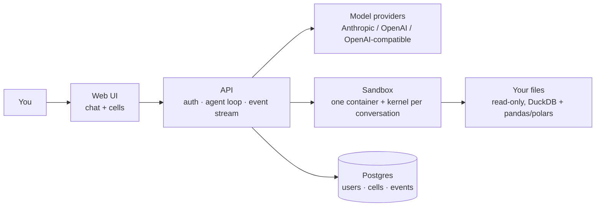

# not-a-notebook

An AI data analyst that shows its work. Drop in a messy file, ask in plain language, and every answer comes back as cells: code you can read, edit and re-run, with charts you can interact with.

Chat on the surface, a real notebook underneath. Bring any model: a frontier API, a small open model, or one running on your own GPU.

## Why

Hosted AI analysts are impressive, but they are built for people who don't write code. The code scrolls past and disappears, charts are pictures, and you can't reproduce the analysis. They also run in someone else's cloud, on someone else's model.

not-a-notebook gives the same experience to people who do write code, and keeps them in control of what actually ran.

## What you get

- **Every answer is cells.** Persistent, editable, re-runnable. Yours and the agent's are the same thing, and the agent sees your edits. Re-run one in the middle and the ones below go stale; **Run all** proves the analysis reproduces.
- **Export that runs.** `.ipynb` or `.py`, with the chat placed among the cells. The notebook runs anywhere, with no edits.
- **It reads your file like an analyst would.** On upload the file is profiled: subtotal rows, duplicates, mixed number and date formats, inconsistent labels, outliers, missing values. Suspicious values are reported, never silently fixed.
- **It asks before guessing.** Ask about "this year" on a file that ends last year and you get a question back.
- **It checks itself.** Every number in an answer is looked up in the notebook's outputs. One that isn't there is flagged.
- **Any model.** Anthropic, the OpenAI Responses API, or anything OpenAI-compatible (Ollama, vLLM, LM Studio, OpenRouter, DeepSeek, Qwen…). Models that are weak at tool calling can write a fenced code block instead.
- **Your data stays yours.** Self-host with one `docker compose up`. Point it at a local model and nothing leaves the machine.

## Does it work?

Measured on three public files nobody here wrote (Titanic, Palmer penguins, restaurant tips), five questions each, three repeats, with DeepSeek V4.1 Flash. Answers were checked against numbers worked out in plain Python, without a model.

| Of 45 answers | |
| --- | --- |
| right | **44** |
| wrong, but flagged | 1 |
| wrong and silent | **0** |

Wrong-and-silent is the one that matters: a confident, wrong number with no warning.

An open question like "analyze this file" took 2 to 5 cells. A question the notebook had already answered took none.

This is a small first measurement: one model, three files. Other models, prompt injection and a public benchmark are next.

## Run it

Docker with Compose is all you need.

```bash
git clone https://github.com/not-a-corp/not-a-notebook.git
cd not-a-notebook
cp .env.example .env    # fill POSTGRES_PASSWORD, JWT_SECRET and SECRETS_KEY
docker compose up -d --build --wait
```

Open `http://localhost:3000`, create your account, add a model and drop in a file.

## How it works



FastAPI and PostgreSQL 18 with raw SQL on the back, React and TypeScript on the front, Jupyter in the sandbox. The contracts are written down: [`api.md`](api.md) for HTTP, [`events.md`](events.md) for the event stream.

### Running generated code

Each conversation gets its own container with a persistent Jupyter kernel and **no internet**: every package is baked into the image, and the kernel can reach the API that drives it and nothing else. Your files are mounted read-only, and CPU, memory and time are capped. Plain Docker does not protect against a container escape; for that, run the sandbox under gVisor.

Provider keys are encrypted with AES-256-GCM before they reach the database, and a credential never enters the sandbox. **Back up `SECRETS_KEY` separately from the database**: lose it and every stored key is lost.

## Not yet

A desktop app, database connectors, SQL cells, promoting an analysis to a pipeline, teams, reactive cells and real-time collaboration. They come when someone needs them.

## Contributing

Messy real-world datasets (anonymized) that break other tools are the most useful contribution. Open an issue describing what you'd analyze and where current tools fail you.

## License

[AGPL-3.0](LICENSE). Use it, change it, host it. If you offer a modified version as a service, share your changes under the same terms.

---

Part of [not-a-corp](https://github.com/not-a-corp).
